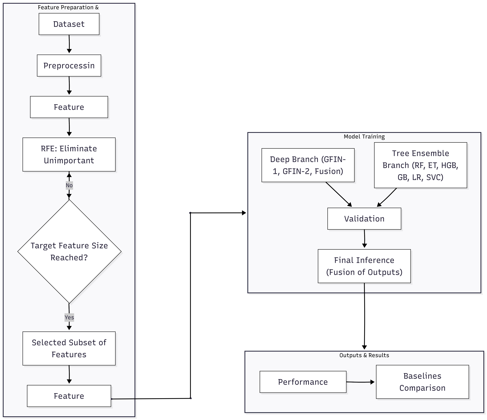
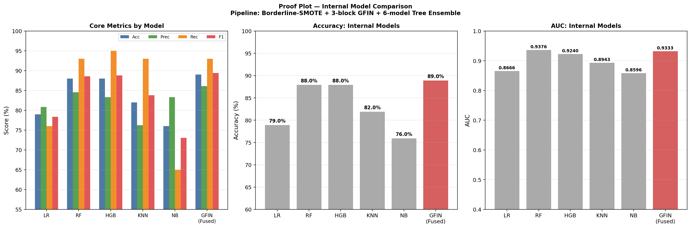
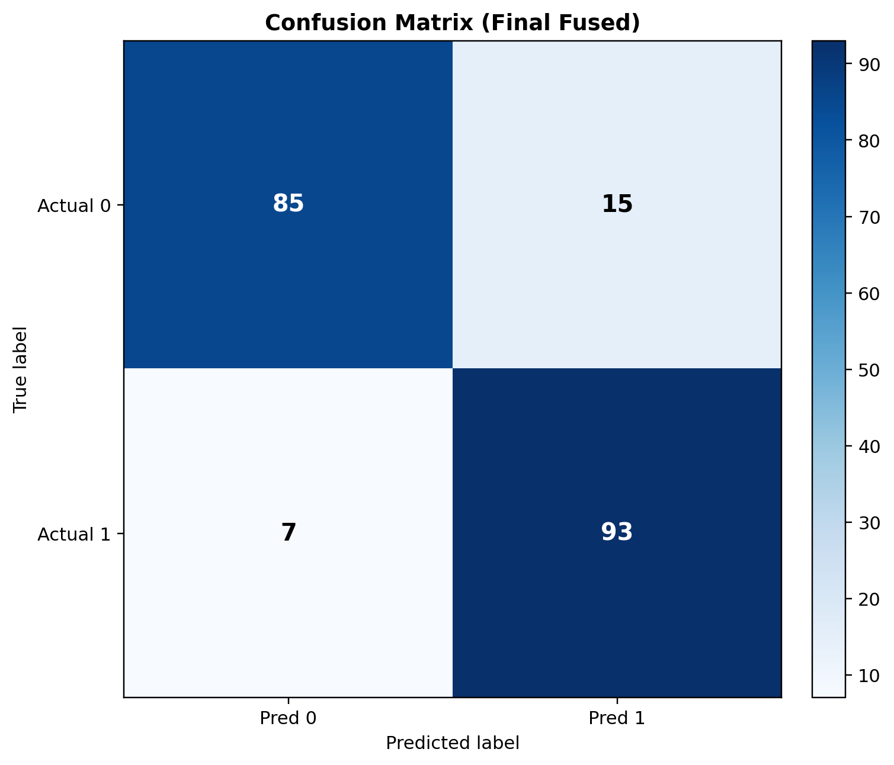
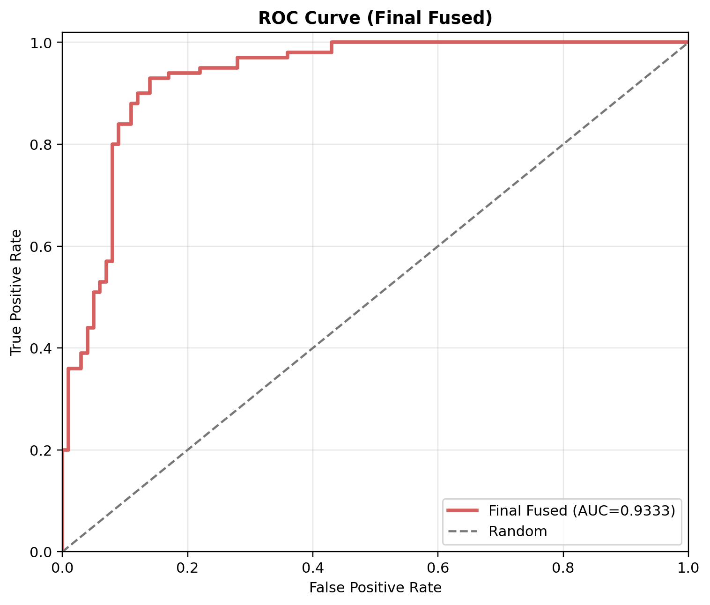
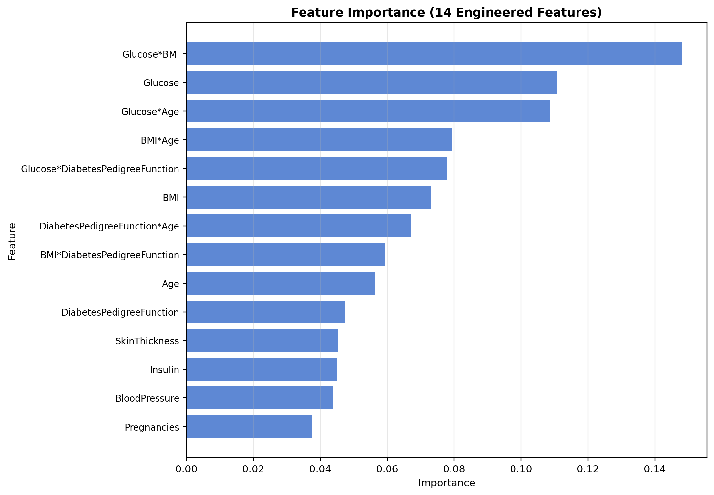
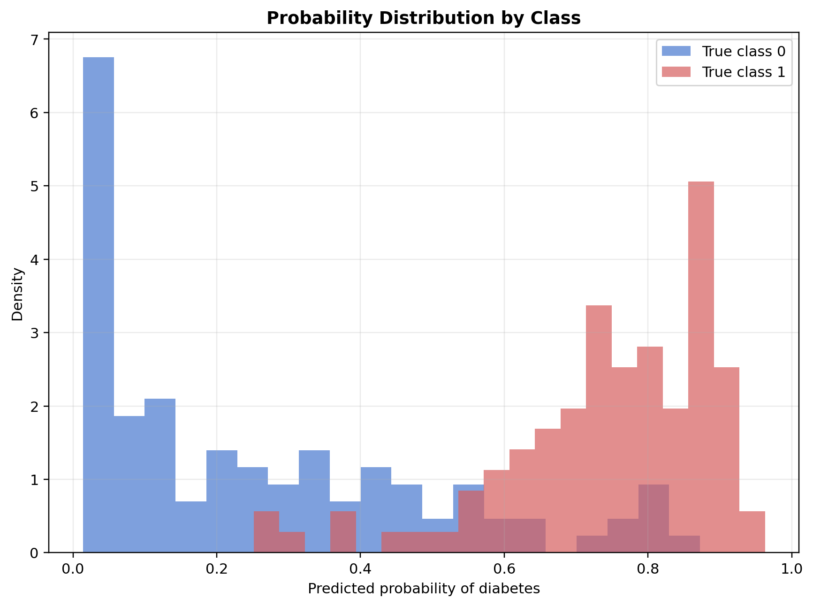
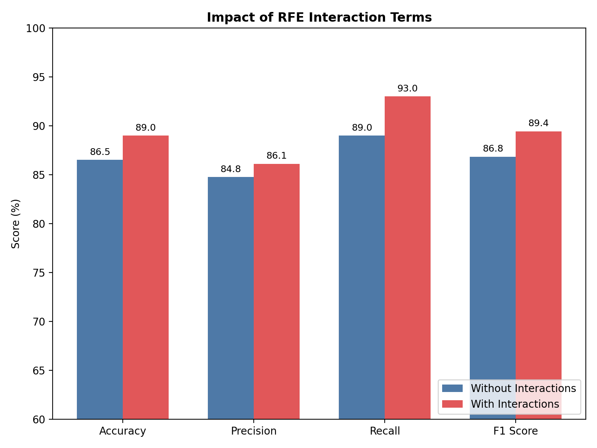
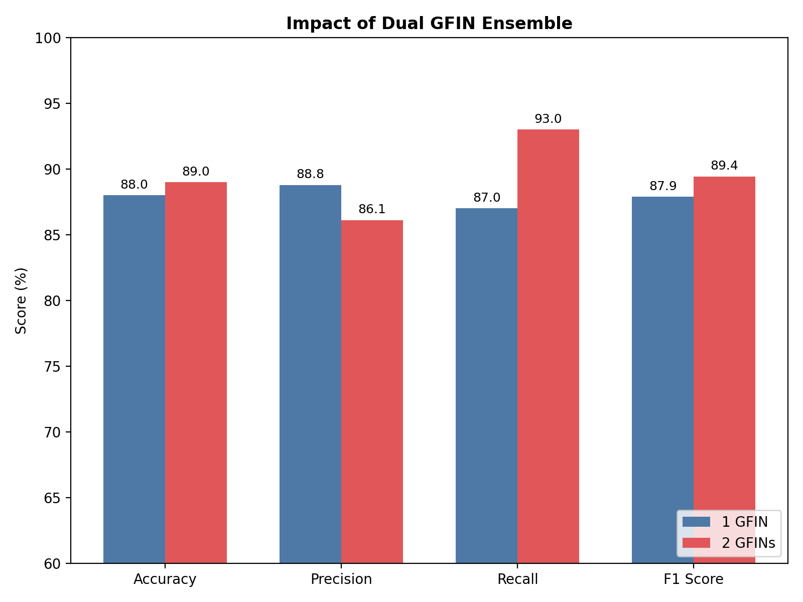
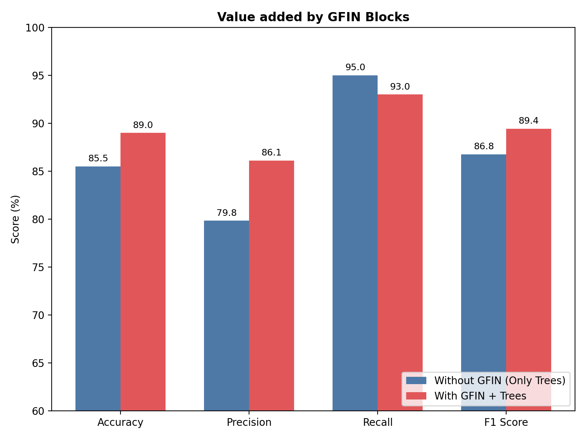
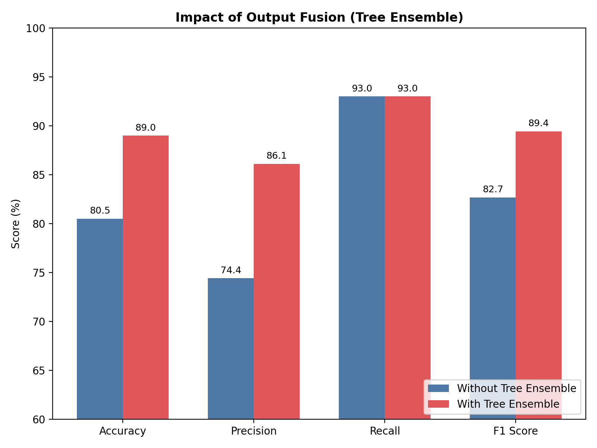

# GFIN: Gated Feature Interaction Network for Diabetes Classification

This repository contains the official implementation of the GFIN architecture, proposed for robust diabetes classification using the PIMA Indians Diabetes Dataset.

The pipeline integrates Borderline-SMOTE, Recursive Feature Elimination (RFE), an engineered 14-dimensional feature space, and a novel 3-block Gated Feature Interaction Network fused with a diverse 6-model tree ensemble.

## Architecture Overview

The system is designed to handle medical datasets with skewed distributions and complex feature interactions.

1. **Preprocessing**: Missing medical values (encoded as 0) are handled via median imputation to resist outlier pull. MinMax scaling is applied.
2. **Data Balancing**: Borderline-SMOTE generates synthetic samples exclusively near the decision boundary, providing informative hard negatives.
3. **Feature Engineering**: 
   - Recursive Feature Elimination (RFE) extracts the 4 most critical base features.
   - 6 pairwise interaction terms are computed.
   - Result: A rich 14-dimensional feature vector.
4. **Deep Branch (GFIN)**: 
   - **Role**: Functions as an independent probability predictor running in parallel to the trees (not a feature extractor). Its smooth, non-linear boundaries act as an excellent regularizer to correct the edge-case errors of axis-aligned tree splits.
   - **Feature Attention Gate**: Applies a learned sigmoid mask to input features.
   - **3-Block Structure**: Employs adaptive update gates applied over feature representations (non-sequential).
     - Block 1: GELU Activation + Batch Normalization
     - Block 2: GELU Activation
     - Block 3: Swish Activation
   - **Ensemble**: Dual GFINs trained with varied initializations, batch sizes, and learning rates (cosine annealing).
5. **Tree Ensemble Branch**: Composed of Random Forest, ExtraTrees, Histogram Gradient Boosting, Gradient Boosting, Logistic Regression, and Support Vector Classifier.
6. **Late Fusion**: Alpha-blended probability fusion between the deep branch and the tree branch, with decision thresholds optimized dynamically on a validation split.



## Repository Structure

- `GFIN.py`: Main implementation pipeline. Contains data preprocessing logic, GFIN class definition, tree ensemble setup, prediction fusion, and evaluation scripts.
- `pima-indians-diabetes.csv`: PIMA Indians Diabetes Dataset.
- `outputs/`: Automatically generated visualizations and metrics tables.

## Setup & Installation

**Prerequisites:**
- Python 3.8 or higher
- Required Libraries: `numpy`, `pandas`, `scikit-learn`, `matplotlib`

```bash
# Clone the repository
git clone <your-repo-url>
cd <repo-name>

# Install required dependencies
pip install numpy pandas scikit-learn matplotlib
```

## How to Run

Execute the main pipeline directly using Python. The script handles end-to-end processing: it scales the data, trains both the GFIN models and the tree ensembles, tunes the fusion threshold on the internal validation set, and strictly evaluates the final combined model on the holdout test set.

```bash
python GFIN.py
```

*Note: Ensure `pima-indians-diabetes.csv` is located in the root directory prior to execution.*

## Evaluation & Results

The internal evaluation strictly follows an 80/20 stratified split. 

### Baseline Comparison (Threshold = 0.50)

| Model | Accuracy (%) | Precision (%) | Recall (%) | F1 Score (%) | AUC |
|---|---:|---:|---:|---:|---:|
| Logistic Regression | 79.00 | 80.85 | 76.00 | 78.35 | 0.8666 |
| Random Forest (200 trees) | 88.00 | 84.55 | 93.00 | 88.57 | 0.9376 |
| Hist. Gradient Boosting | 88.00 | 83.33 | 95.00 | 88.79 | 0.9240 |
| K-Nearest Neighbours | 82.00 | 76.23 | 93.00 | 83.78 | 0.8943 |
| Naive Bayes | 76.00 | 83.33 | 65.00 | 73.03 | 0.8596 |

### Final Fused GFIN Performance (Per-Class)

| Class | Precision (%) | Recall (%) | F1 Score (%) | Support |
|---|---:|---:|---:|---:|
| Class 0 (Non-Diabetic) | 92.39 | 85.00 | 88.54 | 100 |
| Class 1 (Diabetic) | 86.11 | 93.00 | 89.42 | 100 |
| **Macro Average** | **89.25** | **89.00** | **88.98** | **200** |

*Overall test accuracy achieved is **89.00%**.*

### Performance Visualizations

The execution script automatically generates detailed evaluation plots in the `outputs/` directory.

**Core Metrics & Proof Plot**  


**Confusion Matrix & ROC Curve**  
<div style="display: flex; justify-content: space-between;">
  
  
</div>

**Feature Importance & Probability Distribution**  
<div style="display: flex; justify-content: space-between;">
  
  
</div>

## Ablation Studies

To isolate the contribution of each architectural component, we conducted a series of ablation studies on the pipeline. All tests were performed on the same 80/20 data split.

### 1. Impact of RFE Interaction Terms
Explicitly providing the network with multiplied feature pairs (14-dim vs 8-dim) allows it to discover non-linear medical relationships faster.
- **Without Interactions:** Accuracy: 86.50% | F1 Score: 86.83%
- **With Interactions (Full Model):** Accuracy: 89.00% | F1 Score: 89.42% *(+2.5% Accuracy)*



### 2. Single GFIN vs. Dual GFIN Ensemble
Averaging the probabilities of 2 distinct GFINs (trained with different seeds and hyperparameters) mitigates neural network initialization variance.
- **1 GFIN:** Accuracy: 88.00% | F1 Score: 87.88%
- **2 GFINs (Full Model):** Accuracy: 89.00% | F1 Score: 89.42% *(+1.0% Accuracy)*



### 3. Tree Ensemble Fusion & GFIN Value
The final architecture uses late fusion to take a weighted average of the predictions from the GFIN deep branch and the Tree Ensemble branch. 
- **Only GFINs (No Trees):** Accuracy: 80.50% | F1 Score: 82.67%
- **Only Trees (No GFINs):** Accuracy: 85.50% | F1 Score: 86.76%
- **Fused Full Model:** Accuracy: 89.00% | F1 Score: 89.42%

*Why does fusion work?* Even though the Tree Ensemble is strong on its own (85.5%), it relies on hard, axis-aligned splits. The GFIN networks map smooth, complex, non-linear boundaries. Because they make completely different types of errors, taking their weighted average allows the GFIN to regularize the edge-cases that trees miss, breaking through the performance ceiling to reach **89.0%** (+3.5% over trees alone).

<div style="display: flex; justify-content: space-between;">
  
  
</div>